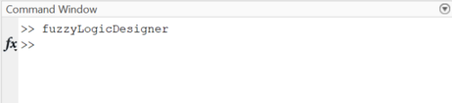
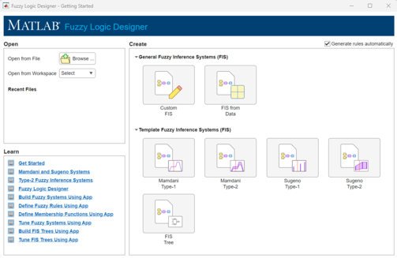
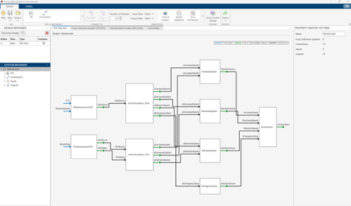
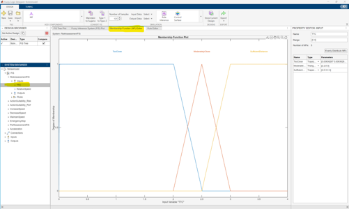
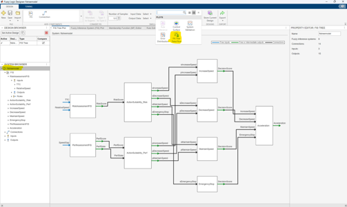
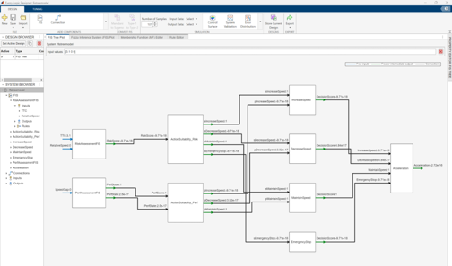

# RAFAEL

This repository contains the MATLAB/Simulink implementation of the RAFAEL decision-making approach presented in:
> Bin Firoz, Hasan, Colin Paterson, and Richard David Hawkins (2026). RAFAEL: A Rational Fuzzy Approach for Explainable, Adaptive and Safe Decision-making under Uncertainty. SAFECOMP 2026, 9th Workshop on Artificial Intelligence in Safety Engineering (WAISE).

The implementation demonstrates the design and simulation-based evaluation of a rational hierarchical fuzzy decision-making component for a Mobile Autonomous System (MAS) in a car-following scenario.

## MATLAB Version
All the MATLAB files and Simulink models were created using **MATLAB R2024a**.

## Repository Contents
The repository contains four main files:

<details open>
  <summary><b>fistreeDecisionComponent.mat</b></summary>
  
  This file contains the hierarchical fuzzy decision-making component proposed in the RAFAEL paper. The component can be inspected and explored using the **Fuzzy Logic Designer App** in MATLAB. The hierarchical structure, individual fuzzy inference systems (FISs), membership functions, and fuzzy reasoning can be examined directly.

  The decision-making component assesses a driving situation in terms of **risk and performance**, evaluates the suitability of the available action alternatives based on the assessed risk and performance independently, and performs a trade-off between risk and performance to determine the final acceleration command.

  The main input variables are:

  - Time-to-Collision (TTC)
  - RelativeSpeed
  - SpeedGap

  These inputs can be manually varied in the FIS Tree Data Flow view to investigate how the decision-making component responds to different driving situations.
  
</details>

<details>
  <summary><b>Simulation_RAFAEL.slx</b></summary>
  
  This file contains the complete decision-making pipeline for the Mobile Autonomous System.

  The Simulink model includes:

  - Sensing
  - Understanding of the situation
  - Decision-making
  - Acting (i.e., control)
  - A simplified model of MAS dynamics

  The decision-making component is deployed within this simulation environment to evaluate its behaviour in a dynamic car-following scenario.
  
</details>

<details>
  <summary><b>init_file.m</b></summary>
  
  This MATLAB script contains the initial parameters required to initialise and run the simulation using **Simulation_RAFAEL.slx** file.
  
</details>

<details>
  <summary><b>TestScenario.mat</b></summary>
  
  This file contains the test scenarios used to evaluate the decision-making component.

  At present, two situations of car-following scenario are included:

  1. HarshBraking
  2. VaryingSpeed

  These provide different driving situations for evaluating the behaviour of the proposed decision-making component.
  
</details>

## Getting Started
### Requirements
- MATLAB R2024a or higher
- Simulink
- Fuzzy Logic Toolbox

### 1. Open the RAFAEL Decision-Making Component

To inspect the hierarchical decision-making architecture:
1. Open MATLAB
2. Open the **Fuzzy Logic Designer App** by entering the following command in the command window of MATLAB:
   ```Matlab
   fuzzyLogicDesigner
   ```
   
   
   This will open an window as follow:
   
   
   
3. Select **Open from file** from the left bar and then browse to and open **fistreeDecisionComponent.fis** file. This will open a window as follows:

   

The hierarchical structure of the decision-making component can then be inspected through the Fuzzy Logic Designer interface.

### 2. Inspect the Decision Reasoning

Within the Fuzzy Logic Designer app, individual FISs of decision component can be selected to inspect their input and output variables and membership functions. To do that: 

1. Expand the FIS from the left navigation bar.
2. Select a FIS that you want to inspect and choose the input variable.
3. Click on the **Membership Function (MF) Editor** tab from the top.

     

The decision-making process can also be explored through the **FIS Tree Data Flow** view. To do that:

1. Make sure that **fistreemodel** is selected in the left navigation bar.
2. Click on **FIS Tree Data Flow** from the top ribbon.

   

A new bar with three value enclosed by the square bracket will appear on the top. These three values can be changed manually. The first, second and third value represent Time-to-Collision (TTC), RelativeSpeed and SpeedGap respectively. 



Changing these inputs allows different driving situations to be simulated.

For example, a safe car-following situation can be represented using:

TTC = 3.1

RelativeSpeed = 0

SpeedGap = 0

This represent a situation in which there is sufficient separation between the vehicles, the following distance is not changing, and the ego vehicle is travelling at its desired speed.

> [!Note]
> The accepted range of values for these inputs are:
> <p>0 <= TTC <= 4</p>
> <p>-31.3 <= RelativeSpeed <= 31.3</p>
> <p>-1 <= SpeedGap <= 1</p>

### 3. Run the Simulink Simulation
To test the decision-making component in the car-following environment:

1. Open **Simulation_RAFAEL.slx** file.
2. Open the **List of Scenario** block in the simulink model and choose either **HarshBraking** or **VaryingSpeed**
3. Run the simulation

## Citation
If you use this implementation in your research, please cite the accompanying paper.

A **CITATION.cff** file is provided to support citation of this repository and the paper.

## Contact
For questions regarding the implementation, please contact the author **[Hasan Bin Firoz](hasan.binfiroz@york.ac.uk)**
